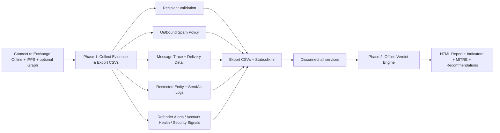

# Sender Restriction Analyzer

A read-only PowerShell diagnostic tool that investigates **outbound mail sending-limit blocks** (Restricted Recipient List / RRL restrictions) in Exchange Online. It collects evidence from Exchange Online, Security & Compliance, and (optionally) Microsoft Graph, applies a deterministic verdict engine to classify the restriction, and produces a self-contained interactive HTML report.

- **Script:** `SenderRestrictionAnalyzer.ps1`
- **Author:** Abdullah Zmaili
- **Version:** 1.0
- **Requires:** PowerShell 5.1+, `ExchangeOnlineManagement` module (required), `Microsoft.Graph.Authentication` module (optional — Defender alerts)

> ⚠️ **Read-only:** The script uses only `Get-*` / `Search-*` cmdlets. It never unblocks senders, changes policy, deletes rules, or submits messages. All remediation appears as guidance text only.

---

## What It Does

- Validates the affected user's mailbox
- Retrieves the applicable outbound spam policy limits (per-hour / per-day, internal / external)
- Collects message-trace evidence with external vs. internal recipient classification and per-recipient delivery detail
- Checks restricted-entity (blocked sender) status
- Collects SendAs / SendOnBehalf unified audit events
- Pulls Microsoft Defender for Office 365 alerts (with MITRE ATT&CK techniques)
- Evaluates mailbox security insights (forwarding, inbox rules, delegation, subject similarity, quarantine, audit state)
- Produces a verdict: `EXPECTED_BLOCK_DAILY`, `EXPECTED_BLOCK_HOURLY`, `EXPECTED_BLOCK`, or `NO_BLOCK_FOUND`
- Generates an interactive HTML report with charts, filtering, indicators, MITRE mapping, and recommendations

---

## How It Works



The tool runs in **two phases**:

1. **Phase 1 (online):** Connects to Microsoft 365, collects all evidence into memory, and exports it to per-dataset CSV files plus a full-fidelity `State.clixml` snapshot. All cloud connections are then closed.
2. **Phase 2 (offline):** Re-reads the exported state, runs the verdict engine, and builds the HTML report — with **no further remote calls**.

---

## Requirements

| Requirement | Detail |
|-------------|--------|
| PowerShell | 5.1 or later |
| Module (required) | `ExchangeOnlineManagement` |
| Module (optional) | `Microsoft.Graph.Authentication` (Defender alert signals) |
| Permissions | Least-privilege recommended: **Security Reader** + **View-Only Recipients** (NOT Global Admin) |
| Graph scopes | `User.Read.All`, `UserAuthenticationMethod.Read.All`, `Directory.Read.All`, `AuditLog.Read.All`, `SecurityAlert.Read.All` |

Install the modules:

```powershell
Install-Module ExchangeOnlineManagement -Scope CurrentUser
Install-Module Microsoft.Graph.Authentication -Scope CurrentUser   # optional
```

---

## Quick Start

```powershell
.\SenderRestrictionAnalyzer.ps1 -AffectedUPN user@contoso.com -AdminUPN admin@contoso.com
```

Run with no parameters to be prompted interactively:

```powershell
.\SenderRestrictionAnalyzer.ps1
```

See [QUICKSTART.md](QUICKSTART.md) for a 5-minute walkthrough and [INSTRUCTIONS.md](INSTRUCTIONS.md) for full parameter and troubleshooting details.

---

## Parameters

| Parameter | Type | Default | Description |
|-----------|------|---------|-------------|
| `-AffectedUPN` | string | *(prompted)* | UPN of the affected sender being investigated. |
| `-AdminUPN` | string | *(current context / prompted)* | Admin UPN used to connect to Exchange Online and Security & Compliance. |
| `-OutputPath` | string | script directory | Folder for the report, CSVs, and state file. |
| `-LookbackDays` | int (1–90) | `7` | Days of message-trace history to analyze. |
| `-SkipDefender` | switch | off | Skip Defender / Security & Compliance collection. |
| `-SkipHistoricalSearch` | switch | off | Skip async historical search beyond 10 days. |
| `-SkipMessageTraceDetail` | switch | off | Skip per-recipient delivery-detail lookups (fastest). |
| `-MaxDetailLookups` | int (0–5000) | `200` | Cap on per-recipient delivery-detail lookups. |
| `-ParallelDetailLookups` | switch | off | Fan detail lookups across a pool of EXO runspaces. |
| `-DetailThrottleLimit` | int (2–8) | `4` | Parallel runspace count when `-ParallelDetailLookups` is set. |

---

## Output Files

All files are written to `-OutputPath` and prefixed with the affected UPN and a timestamp.

| File | Contents |
|------|----------|
| `RRLAnalysis_<user>_<timestamp>.html` | Interactive report (open this). |
| `RRL_<user>_<timestamp>_MessageTrace.csv` | Message-trace rows (nested delivery detail as JSON). |
| `RRL_<user>_<timestamp>_DailyStats.csv` | Per-day message/recipient aggregates. |
| `RRL_<user>_<timestamp>_StatusBreakdown.csv` | Delivery-status breakdown. |
| `RRL_<user>_<timestamp>_TopRecipientDomains.csv` | Top recipient domains. |
| `RRL_<user>_<timestamp>_RestrictedEntity.csv` | Restricted-entity / blocked-sender status. |
| `RRL_<user>_<timestamp>_SendAsLogs.csv` | SendAs / SendOnBehalf audit events. |
| `RRL_<user>_<timestamp>_DefenderAlerts.csv` | Defender alerts with MITRE techniques. |
| `RRL_<user>_<timestamp>_SuspiciousInboxRules.csv` | Inbox rules flagged as security signals. |
| `RRL_<user>_<timestamp>_State.clixml` | Full-fidelity object snapshot used by Phase 2 (and for offline re-analysis). |

> 🔒 **Confidential:** Output contains UPNs, recipient addresses, message metadata, and security posture. Treat as confidential and do not email unencrypted.

---

## Report Tabs

- **Overview / Verdict** — classification, evidence, and policy-limit comparison.
- **Message Trace** — searchable/sortable/paged message rows, daily stats, status breakdown, top domains.
- **Mailbox Security Insights** — indicators such as external forwarding, inbox rules, auto-forward to free webmail, delegation/SendAs, subject similarity, active Defender alerts, quarantined outbound mail, and audit state.
- **Recommendations** — supported high-volume sending alternatives (High Volume Email for Microsoft 365, Azure Communication Services Email, dedicated bulk/marketing provider).

---

## Disclaimer

This script is provided "as is" without warranty of any kind. You are responsible for how you use it and for any outcomes resulting from its execution. The entire risk arising out of the use or performance of the script remains with you.
